# Ray-Cast Maze

A Wolfenstein-style raycaster written from scratch in Python. Escape four mazes seen through
a first-person view that is built one vertical column of pixels at a time.

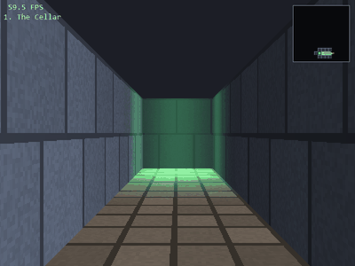

---

## Overview

### What raycasting is

The world here is **completely flat**. There is no 3D model of the maze anywhere in this
project — no vertices, no triangles, no mesh. A level is just a 2D grid of integers, the same
kind of thing you would draw a top-down map from:

```python
[1, 1, 1, 1, 1, 1],
[1, 0, 0, 0, 0, 1],      # 0 is empty floor
[1, 0, 2, 2, 0, 1],      # anything else is a wall, and the number picks its texture
[1, 0, 0, 0, 0, 1],
[1, 1, 1, 1, 1, 1],
```

The trick that turns that grid into a first-person view is this: **the screen is drawn one
vertical column at a time, and each column needs exactly one number — the distance to the
nearest wall in that direction.**

So for every one of the 400 columns across the screen:

1. **Cast a ray** out from the player across the 2D map, in the direction that column looks.
2. **Walk it forward** cell by cell until it enters a wall. Record how far it travelled.
3. **Divide.** A wall's height on screen is inversely proportional to its distance —
   `height = K / distance`. Something twice as far away is drawn half as tall.
4. **Draw one vertical strip** of texture at that height, centred on the horizon.

Put 400 of those strips side by side and the eye reads a solid 3D corridor. Nothing was ever
rotated or projected in three dimensions; the whole illusion is a **2D visibility problem plus
one division per column**.

These two pictures are the *same instant* — the left is what the code actually computes, the
right is what you see. The cyan lines are the rays; each one becomes a single vertical strip on
the right:

| What the code computes (Tab view) | What you see |
|---|---|
| 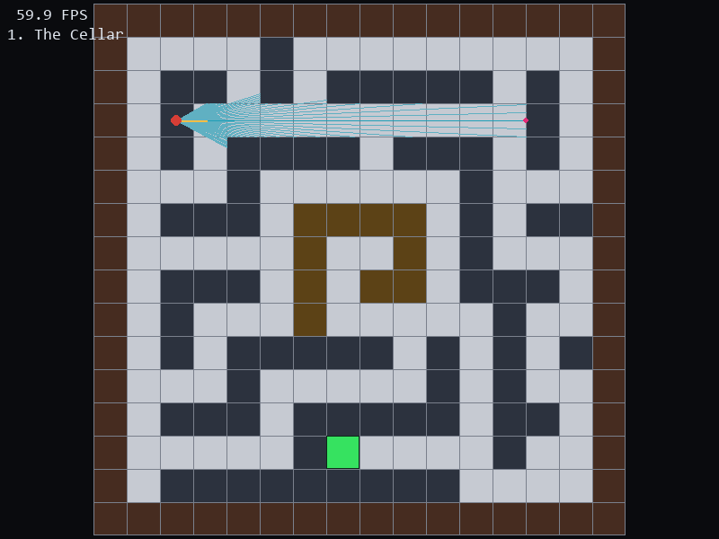 | 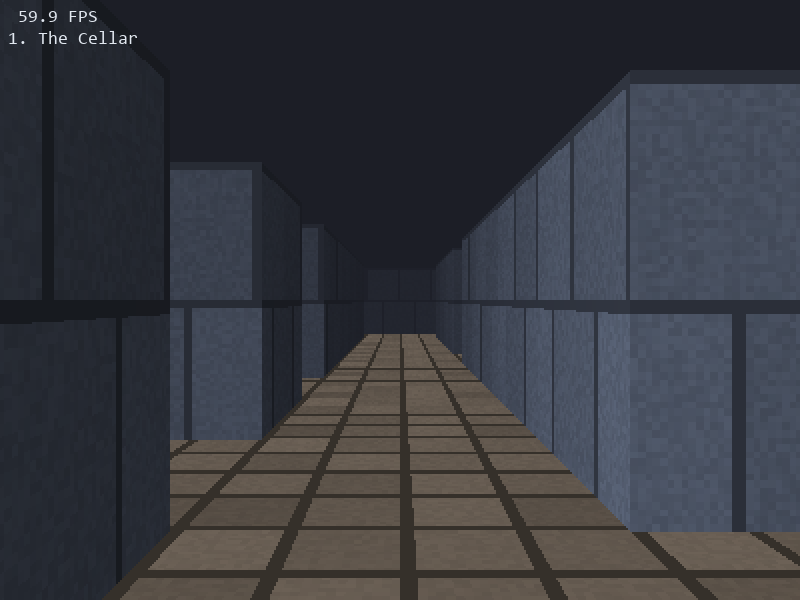 |

This is how Wolfenstein 3D ran on a 1992 PC, and it is why this runs at 60 FPS in pure Python:
the expensive part of real 3D — actual geometry — never happens.

The approach buys its speed by giving things up, and those limits shape the whole game: walls
are always axis-aligned, always a whole cell thick, and always the same height. Everything on
screen is either a vertical wall strip or a horizontal plane seen in perspective (the floor, and
the tops of the steps).

### What is hand-written here

Pygame is used as a **pixel canvas and an input handler, nothing more**. There is no 3D engine,
no OpenGL, and no `pygame.draw` call doing perspective work. Every part of the image is produced
by hand:

- rays are marched through the grid with a DDA to find walls,
- wall heights come from a perspective divide written out in full,
- textures are generated procedurally, then sampled with hand-written nearest and bilinear filters,
- floors and step tops come from inverting the projection once per screen row,
- fog, lighting, the exit beacon and the minimap's shadow are per-pixel maths on a numpy buffer.

The frame is drawn into a 400×300 numpy array indexed `[x, y, channel]`, then upscaled to the
800×600 window once per frame. That low internal resolution is what makes per-pixel floor
casting, mipmapping and bilinear filtering affordable at 60 FPS in pure Python.

---

## Install and getting started

Requires **Python 3.11+**.

```bash
git clone https://github.com/jinMori127/Ray-Cast-Maze.git
cd Ray-Cast-Maze

python -m venv .venv
.venv\Scripts\activate        # Windows
# source .venv/bin/activate   # macOS / Linux

pip install -r requirements.txt
python main.py
```

Dependencies are only:

| Package | Why |
|---|---|
| `pygame-ce` | window, input, and blitting the finished pixel buffer |
| `numpy` | the pixel buffer and every vectorised per-pixel operation |

---

## About the game

You are dropped into a dark maze and have to find the exit. The exit is not marked on your
screen with an arrow — it is a **green light** bleeding onto the walls and floor of the dead end
it sits in. You find it by exploring and noticing the glow down a corridor.

There are four levels, in increasing order of how far the exit sits from the spawn:

| # | Level | Grid | Steps to exit | Character |
|---|---|---|---|---|
| 1 | The Cellar | 16×16 | 26 | Rooms and corridors. No jumping needed. |
| 2 | The Cistern | 20×16 | 30 | Ring corridors around a central chamber. |
| 3 | The Spire | 23×23 | 60 | A single spiral winding in to a gold core. |
| 4 | The Catacombs | 21×21 | 134 | A dense braided maze. The real test. |

**Progression.** Levels unlock one at a time — clear level *N* and level *N+1* opens. Locked
levels show a padlock and cannot be clicked. Progress is written to `progress.json` next to the
game, so unlocks survive closing it. Delete that file to reset.

**Steps.** Levels 2–4 contain mossy one-cell blocks. They are too tall to walk through but low
enough to see over and to jump onto — land on top, walk along, and drop off the far side.

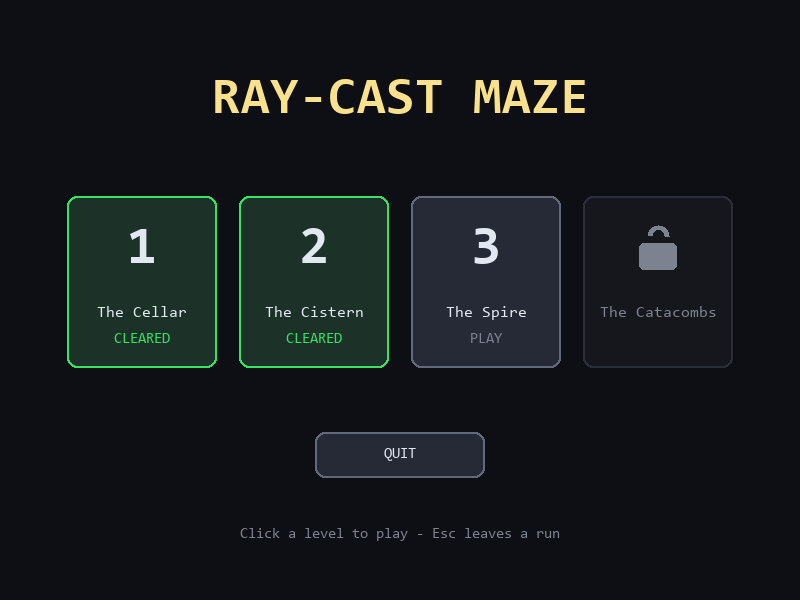

---

## Controls

| Input | Action |
|---|---|
| **W** / **S** | Walk forward / back |
| **A** / **D** | Strafe left / right |
| **Mouse** | Look (the pointer is captured during a run) |
| **←** / **→** | Turn, if you prefer keys to the mouse |
| **Space** | Jump |
| **Esc** | Leave the run, back to level select |
| **Enter** | On the win banner: go to the next level |
| **R** | Restart the current level |
| **Tab** | Toggle the full-screen top-down debug view |
| **M** | Toggle the corner minimap |
| **L** | Toggle mipmapping on/off |
| **B** | Toggle bilinear / nearest texture sampling |
| **Left click** | On level select: start a level, or quit |

`L` and `B` exist so the two sampling schemes can be compared live — see
[Texture sampling](#9-texture-sampling) below.

---

## Gameplay

**The first-person view.** Textured walls, a per-pixel cast floor, exponential distance fog, and
the minimap in the corner.

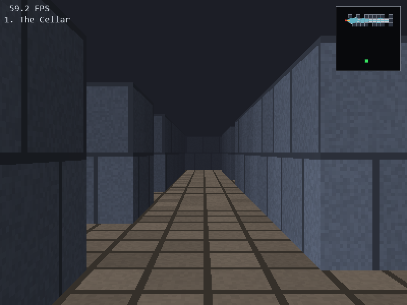

**The exit beacon.** The goal is a green point light. It lands only on surfaces actually facing
it, so it never bleeds through a wall, and it survives the fog so it still reads from the far end
of a corridor.

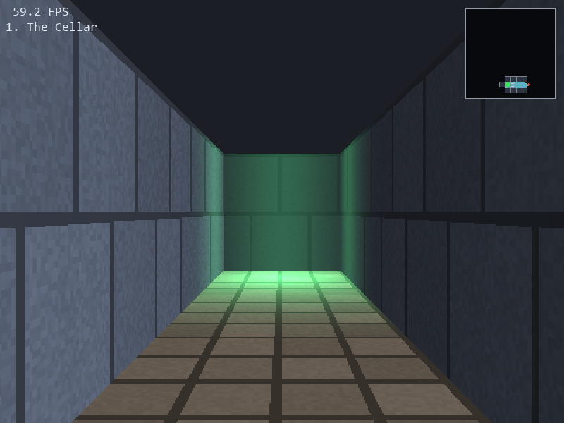

**Steps.** Run at one, jump, land on top, walk off the far side.

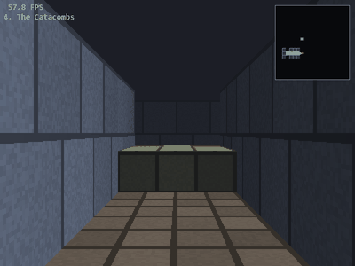

**Looking around.** Per-face shading makes corners read; fog gives depth.

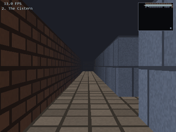

**The debug view (Tab).** The whole grid from above, the full vision cone, the centre ray, and
the exact point it meets a wall. This was the debugger for every stage of the renderer and it is
still in the build.

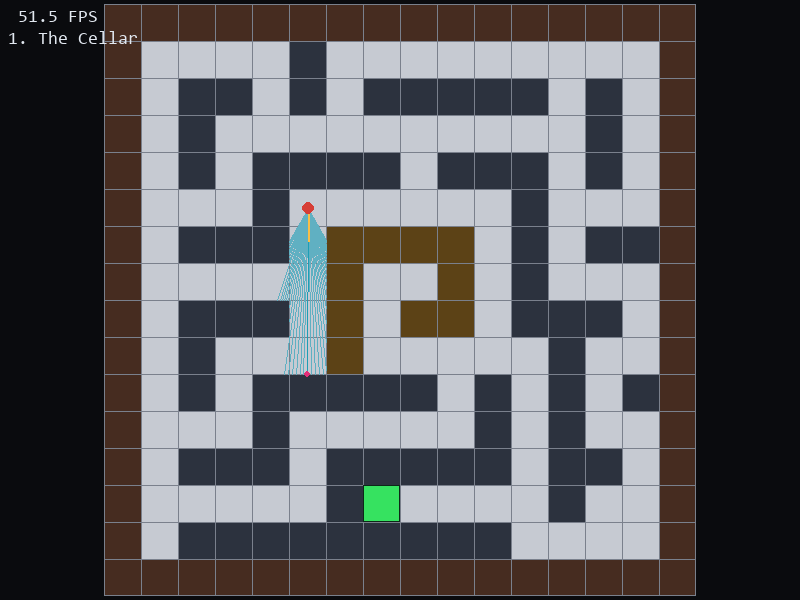

**Escaping.**

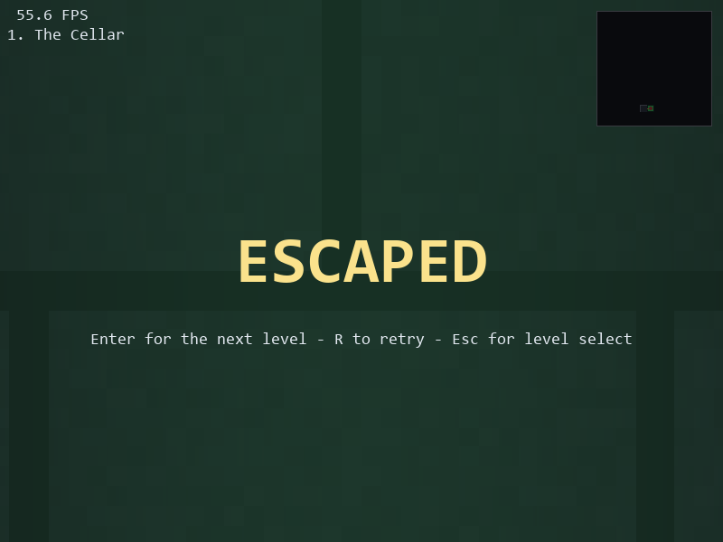

---

## How the rendering works

This is the part that matters. Everything below is written out by hand in `src/`.

### 1. One ray per column

The screen is 400 rendered columns wide, so 400 rays are cast per frame. The rays are **not**
spaced evenly in angle — they are spaced evenly across the *projection plane*:

```
offset[c] = atan( (2·(c + 0.5)/N − 1) · tan(FOV/2) )
```

Spacing them evenly in angle instead would curve straight walls. `FOV` is 60°, so
`tan(FOV/2) = 0.5774` — that is `PLANE_HALF_WIDTH`, the half-width of the projection plane one
unit in front of the camera.

### 2. DDA grid traversal

Each ray walks the grid cell by cell rather than stepping in small increments, so it can never
tunnel through a corner and never wastes work on empty space.

```
delta_x = |1 / dir_x|            # ray length per whole cell crossed in x
delta_y = |1 / dir_y|
```

`side_dist_x` / `side_dist_y` hold the ray length to the next vertical / horizontal grid line.
Each step advances whichever is smaller and records which grid line was crossed. The loop ends
at the first tile tall enough to block the view.

The distance is the `side_dist` **before** the final increment:

```
distance = side_dist_x − delta_x     (crossed a vertical line)
distance = side_dist_y − delta_y     (crossed a horizontal line)
```

No square root is ever taken — the DDA already carries the length.

### 3. Projection: `h = K / d`

```
WALL_SCALE = RENDER_WIDTH / (2 · tan(FOV/2)) = 346.41
```

`WALL_SCALE` is the distance to the projection plane measured in rendered pixels, so both axes
share one perspective scale. For a wall of world height `H` seen at depth `d`, with the eye at
height `z`:

```
column_scale = WALL_SCALE / d        # pixels per world unit at this depth
strip_height = column_scale · H
top          = HORIZON + column_scale · (z − H)
```

Standing normally `z = 0.5` and a wall is `H = 1`, which collapses to the familiar
`top = HORIZON − strip_height/2` — the strip straddles the horizon. Raising the eye (a jump)
slides the strip **down** the screen without resizing it, because height only changes where the
wall sits relative to eye level, never how tall it projects. The horizon itself never moves: it
is the vanishing line for horizontal planes, fixed at eye *level*, not eye *height*.

The strip is deliberately **never clamped** to the screen. A wall taller than the view must be
cropped, not squashed, or its texels would compress as you walk into it instead of magnifying.

### 4. Fisheye correction

Using the raw ray length makes flat walls bulge in the middle. The fix is to project the ray
length onto the view axis:

```
perp_dist = distance · cos(offset)
```

`perp_dist` is what the perspective divide uses. Fog and shading may use either.

### 5. `u` and `v` — texture coordinates

**`u` (horizontal, along the wall face).** It is the fractional position of the hit along the
face's tangent. The tangent points −y, +y, +x, −x for west, east, north and south faces
respectively, which keeps the texture's handedness consistent all the way around a pillar:

```
west face:   along = −hit_y        north face:  along = +hit_x
east face:   along = +hit_y        south face:  along = −hit_x
u = along − floor(along)
```

Negating rather than taking `1 − frac` matters: a hit exactly on a cell corner lands on `u = 0`
instead of wrapping to an out-of-range `1.0`.

**`v` (vertical, down the strip).** Screen rows map back into texture rows across the strip:

```
v = (1 − H)·tex_height + (row_centre − top) · (tex_height / column_scale)
```

The `(1 − H)` term means a short wall takes the **bottom** of its texture rather than squeezing
the whole thing into fewer pixels — so a step's courses stay the same physical size as the tall
walls around it.

### 6. Per-face shading

Lambert's cosine law, with the light as a direction rather than a position:

```
intensity = min(1, AMBIENT + DIFFUSE · max(0, l · n))
```

A grid only ever presents four face orientations, so this is evaluated **four times at import**
and looked up per column, never recomputed. That is what makes inside corners read as corners:
the two faces of a pillar get visibly different brightnesses.

### 7. Exponential distance fog

```
f     = exp(−perp_dist · FOG_DENSITY)          # FOG_DENSITY = 0.20
final = f · lit_texel + (1 − f) · FOG_COLOR
```

The fog colour equals the ceiling colour, so corridors fade into the dark rather than into a
visible haze. Because both the face intensity and `f` are scalars for a given column, the whole
strip is lit and fogged in **one vectorised multiply-add**.

### 8. The textures, and where they come from

**Nothing is loaded from an image file.** All five textures are 64×64 numpy arrays built by code
in `textures.py` when the game starts, indexed `[x, y]` to match pygame's column-major layout so
a wall strip is one contiguous slice.

| Texture | Used by | Pattern |
|---|---|---|
| brick | tile `1`, the outer walls | Running bond: 8 courses × 4 bricks, each course offset half a brick |
| stone | tile `2`, inner walls | Ashlar: 2 × 2 huge blocks with heavy grain |
| checker | tile `3`, the central chamber | Two-tone 8 × 8 checkerboard |
| rubble | tile `4`, the steps | Coarse 3 × 3 mossy blockwork |
| floor | the ground plane | 4 × 4 flagstones |

**Three of them are the same function.** Brick, stone and rubble all come from one `_masonry`
generator — offset courses of blocks separated by mortar joints — differing only in its
arguments: how many courses, how many blocks per course, how dark the joint is, how much tone
varies block to block, and how much fine grain each texel gets. Stone is given far larger blocks
and heavier grain than brick specifically so the two never read as the same wall at a glance.

**The checkerboard is a diagnostic.** A regular two-tone grid makes any texture-mapping mistake
obvious instantly — if `u` picks the wrong axis or `v` is scaled wrong, a checker pattern shears
or swims where masonry would hide it. It stayed in the game as the central chamber's walls.

**Variation without randomness.** Flat colour looks dead, but `random` would make the maze
different every run. Instead there is a small integer hash:

```python
def _hash01(a, b):
    mixed = (a * 73856093) ^ (b * 19349663)
    return ((mixed * 2654435761) % 4294967296) / 4294967296
```

Given a pair of integers it returns a repeatable value in `[0, 1)`. Every block gets a tone
multiplier from the hash of its course and column, and every texel gets a finer grain multiplier
from the hash of its own `(x, y)`. The result looks weathered and irregular, is identical on
every run, and costs no stored noise texture.

**Overridable.** If `assets/<name>.png` (or `.bmp` / `.jpg`) exists it is loaded and scaled to
64×64 instead of generating that pattern, so real artwork can be dropped in without touching
code. The generators are the fallback, not a placeholder.

### 9. Texture sampling

**Mipmaps** (`L` to toggle). Each texture gets a 64 → 32 → 16 → 8 pyramid, box-filtered down one
level at a time. The level is chosen from the minification factor:

```
texels_per_pixel = tex_height / column_scale
level = clamp(floor(log2(texels_per_pixel)), 0, 3)
```

A distant wall squeezes many texels into one pixel, and picking just one of them makes the
choice depend on sub-pixel alignment — that is the shimmer you see down a long corridor with
mipmapping off. Averaging in advance means the pixel gets all of them however the sample lands.
Note the ratio uses `column_scale`, not strip height, because minification depends on depth
alone — so a short step picks the same level as the full wall beside it.

**Bilinear filtering** (`B` to toggle). Blends the four texels around each sample point by the
fractional parts, vectorised over the whole strip rather than per pixel.

| Nearest (default) | Bilinear |
|---|---|
| 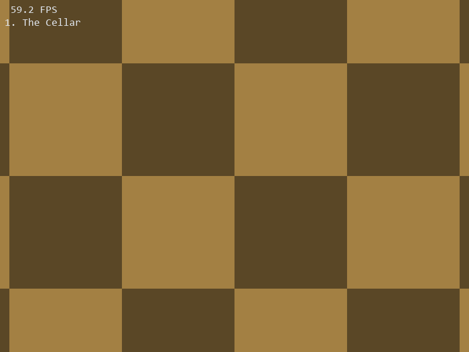 | 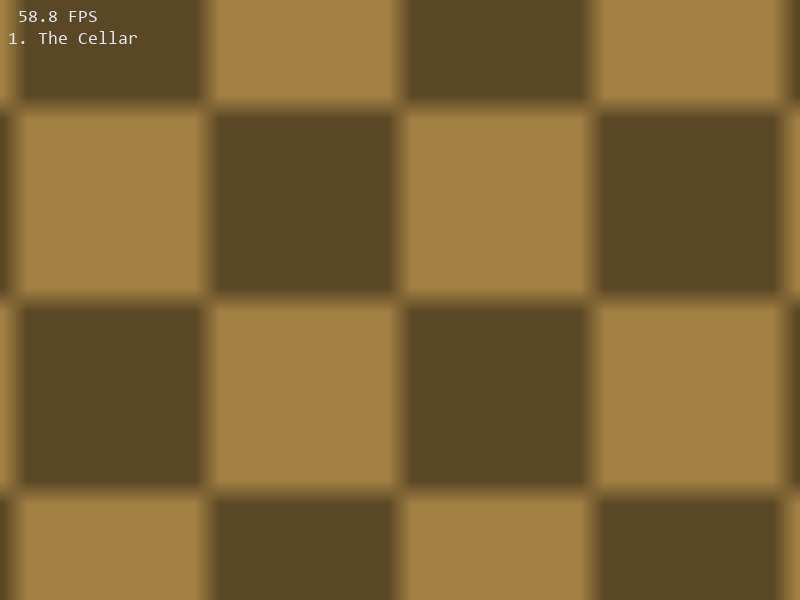 |

### 10. Floor casting

The floor is not a flat fill. For each screen row below the horizon, the projection is
**inverted** to find the world distance that row is looking at:

```
row_distance = WALL_SCALE · z / (row + 0.5 − HORIZON)
```

The world point at each column of that row follows from the camera basis, and the floor texture
is sampled at the fractional world coordinates. One numpy expression per row — never per pixel
in Python:

```
world = player + row_distance · (direction + t · plane)      # t spans −1 … +1 across the row
```

Because it is keyed to world coordinates, the floor stays locked to the world as you walk
instead of sliding with the camera. Raising the eye increases `row_distance` for every row,
which is exactly why you see further along the floor at the top of a jump.

### 11. Step tops — a second ground plane, and a 1D z-buffer

A step is a solid block 0.35 cells tall. Two things follow.

**The ray cannot stop at it.** You can see over a step, so `cast_ray` records it and keeps
marching until it meets a full-height wall. Each column returns the blocking wall plus a list of
the steps in front of it, which are painted afterwards, farthest first.

**It needs a top surface.** The block's top is a horizontal plane at height 0.35, so it is cast
exactly like the floor, just with a different height:

```
step_distance = WALL_SCALE · (z − 0.35) / (row + 0.5 − HORIZON)
```

Wherever that plane lands inside a step cell, the pixel shows the step's top rather than the
floor. Without this the block renders as a flat card and the rows where its top belongs fill
with distant floor — which slides at a different rate as you move, making the block look like it
is wandering around the map.

The tops must be painted **after** the walls, because a step standing in front of a wall projects
into the same rows that wall covers and the nearer surface has to win. That needs a depth test,
so the wall pass records each column's `perp_dist` into a `depths[]` array and the top pass skips
any pixel whose plane distance is greater. That array is a **one-dimensional z-buffer** — "closer
depth wins", in one dimension.

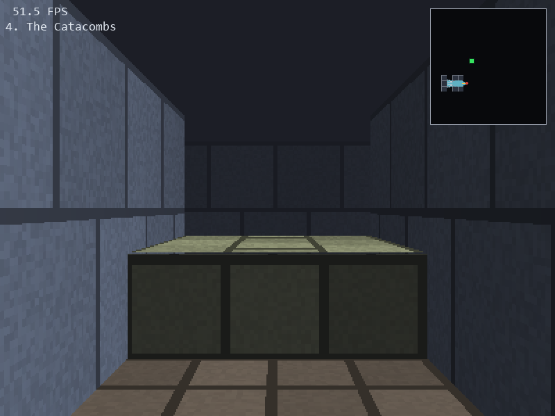

### 12. The exit beacon

A green point light at the goal, with a falloff that reaches exactly zero at a fixed range —
compact support, so there is no infinite tail washing over distant geometry:

```
fade = max(0, 1 − d / RANGE)
glow = fade²
```

On **walls** the falloff is multiplied by a Lambert term against the face normal. That cosine is
what stops the light bleeding through walls: the only faces angled toward the goal cell are the
ones enclosing it, which are exactly the ones you see when you look at the exit. Measured from
one cell behind the exit's wall, the frame contains zero green.

The glow is added **after** the fog blend and fogged at its own gentler rate
(`f ^ 0.5`). Fogging it fully would bury the beacon past about four cells, defeating the point;
not fogging it at all would make it equally bright at every distance and flatten the depth cue.

### 13. Movement, collision and jumping

**Collision** applies each axis separately, so a blocked direction still slides along the wall
instead of stopping dead. The test uses the leading edge plus a player radius of 0.2 cells, and
compares tile height against **foot height** — which is what lets a jump carry you over a step.

**The jump** integrates with the exact constant-acceleration form rather than plain Euler:

```
z += v·dt − ½·g·dt²
v -= g·dt
```

Semi-implicit Euler accumulates a `−g·dt²·n/2` error and lands the apex about 2.5% low; the extra
half-a-t-squared term costs one multiply and makes the arc identical at 30, 60 and 144 FPS. The
feet peak at **0.439 cells** with a **0.62 s** airtime — over a 0.35 step, but only for the 0.84
cells of travel it takes to land on top of it rather than clear it.

The eye is capped at 0.95 (`MAX_EYE_HEIGHT`): you bump your head. Above 1.0 the camera would sit
over the wall tops and see across a maze the rays still stop at, so the ceiling is a real
collision, not a fudge. This is also why a step cannot be taller than half a cell — standing on
one puts the eye at `0.5 + height`, which has to stay under the ceiling.

### 14. The minimap, and why the rest of it is dark

The panel in the top-right corner is a top-down view at 8 pixels per cell, drawn over the
finished 3D frame. It only ever shows **the ground you can actually see from where you stand** —
everything else stays black, so the map fills in as you explore instead of handing you the
solution on the first frame.

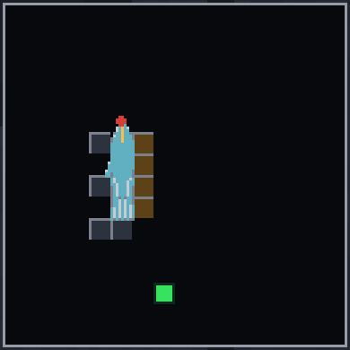

*The pale wedge is what the player can see right now. The blue-grey and brown cells at its edges
are the wall faces the rays landed on. The green square is the exit — always drawn. Everything
else is unseen and stays black.*

It is built from two halves.

**The static half is painted once.** The grid — floor bed, wall cells coloured by tile id, cell
lines — never changes during a run, so it is rendered to a surface the first frame that asks for
it and cached. The cache is keyed by `(level, scale)`, so switching levels cannot serve you the
previous map, and the same code draws both the corner panel and the full-screen Tab view at
different scales.

**The shadow is the interesting half.** The neat part is that **no visibility algorithm was
needed** — the frame already contains the answer. Every ray was marched until it hit a wall, so
the fan of ray endpoints *is* the boundary of what the player can see. It is a by-product of the
render that would otherwise be thrown away.

So the mask is drawn by subtraction rather than addition:

1. Fill a surface with **opaque near-black** — assume nothing is visible.
2. Build a polygon whose first vertex is the player and whose remaining vertices are **every
   ray's hit point**, in screen order. That outline is exactly the visible region.
3. Draw that polygon into the shadow in `(0, 0, 0, 0)` — fully transparent. This **punches a hole**
   in the shadow rather than painting light into it.
4. Blit the shadow over the map.

There is one gap that approach leaves. The polygon's vertices sit *on* the wall faces, so the
wall cells themselves fall outside the hole and would stay black — you would see lit floor
running up to an invisible edge. So every cell a ray actually struck is cleared with a small
rect as well. Which cell that is comes from **the face that was hit**, not from rounding the hit
point: a ray landing exactly on a cell boundary would otherwise round into the neighbour and
reveal the wrong wall.

Finally, the **exit marker and the player marker are drawn after the shadow**, straight over the
top. One is where you are and the other is the objective, and neither is any use hidden.

**Tab** swaps this for the full-screen debugger: the largest whole pixels-per-cell that fits the
window, the entire grid with no shadow at all, the whole vision cone, the centre ray, and a dot
on the exact point it meets a wall. That view came first and every stage of the renderer was
debugged against it — if the ray line stops short of a wall or overshoots into it, the DDA is
wrong, and you can see that instantly from above in a way you never could from inside the maze.

---

## File hierarchy

```
Ray-Cast-Maze/
├── main.py                  160  Window, game loop, the two screens, HUD and win banner
├── requirements.txt              pygame-ce and numpy
├── progress.json                 Written at runtime — how many levels are cleared (gitignored)
├── assets/
│   └── screenshots/              The images in this README
└── src/
    ├── settings.py          107  Every tunable constant: sizes, speeds, palette, fog, light
    ├── levels.py            100  The four map grids, with spawn, facing and exit for each
    ├── world.py              68  The active level and the queries rays and the player run
    ├── player.py             81  Position, look angle, eye height, movement, collision, jump
    ├── raycaster.py          88  DDA traversal, per-column ray fan, u derivation
    ├── renderer.py          209  Projection, wall strips, floor and step-top casting, fog, light
    ├── textures.py          139  Procedural textures, mip pyramids, nearest and bilinear samplers
    ├── minimap.py           121  Corner overlay and the full-screen Tab debug view
    ├── menu.py              118  The level select screen
    └── progress.py           22  Reading and writing the unlock count
```

Conventions that hold everywhere:

- **Angles are radians.** Angle 0 points along +x.
- **Grids are `MAP[row][col]`** — row first. Positions are `(x, y)` — column first.
- **Texture and pixel arrays are `[x, y]`**, matching `pygame.surfarray`, so a screen column or a
  wall strip is one contiguous slice.

Tile ids: `0` empty, `1` border brick, `2` inner stone, `3` chamber, `4` step.

---

## Performance

800×600 window, 400×300 internal buffer, 400 rays, 60 FPS cap:

| Scene | Frame time | Headroom |
|---|---|---|
| The Cellar | 9.0 ms | 111 FPS |
| The Cistern | 9.2 ms | 109 FPS |
| The Spire | 9.5 ms | 106 FPS |
| The Catacombs | 9.0 ms | 111 FPS |
| Looking straight down a corridor at a step | 11.4 ms | 88 FPS |

Everything holds well inside the 16.7 ms budget. What keeps it there:

- **Nothing allocates in the column loop** — the pixel buffer, fog colour, row centres, column
  parameters and the depth array are all module-level and reused.
- **Per-strip work is vectorised.** Lighting and fog are a single multiply-add over the whole
  strip because both factors are scalars for that column.
- **Row and range bounds skip work.** The exit light and the step-top pass each bound which
  screen rows can possibly be affected using the triangle inequality, so most rows are rejected
  by one scalar comparison instead of a vector operation.
- **Flat shading is precomputed** — four face intensities, evaluated once at import.
